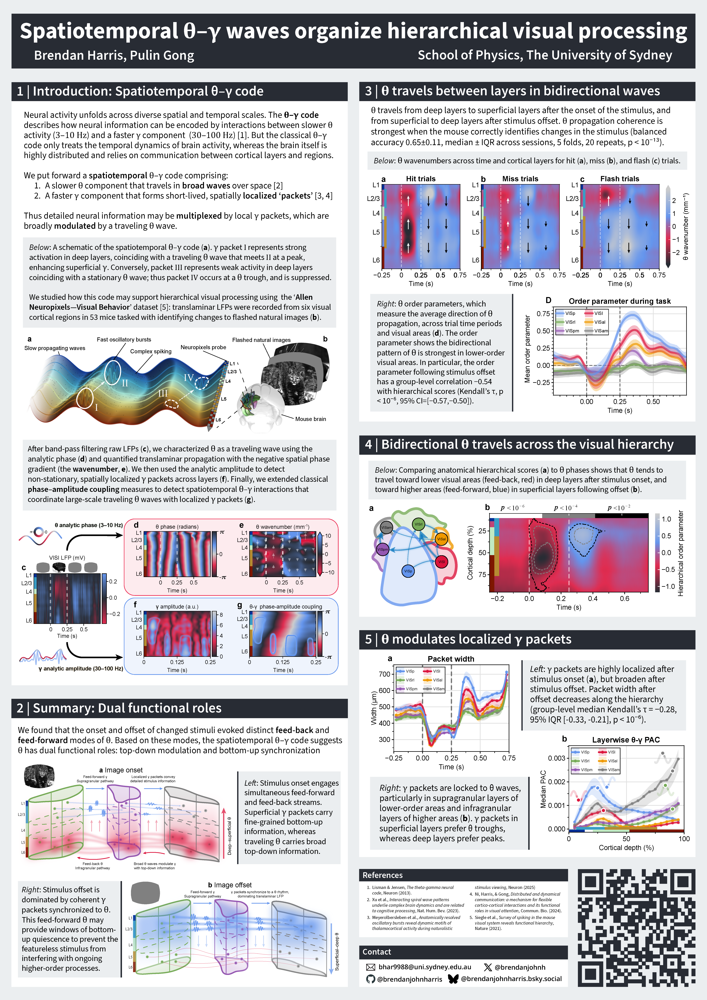

# OHBM_2025
Poster file for "_Spatiotemporal theta--gamma waves organize hierarchical processing in the mouse visual cortex_", presented at OHBM 2025 in Brisbane (Poster 2072, 27th & 28th June)

## Additional links

💻: [Code repository](https://github.com/brendanjohnharris/SpatiotemporalMotifs.jl)

